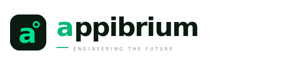

<picture>
  <source media="(prefers-color-scheme: dark)" srcset="logos/lockup/lockup_dark.svg">
  <source media="(prefers-color-scheme: light)" srcset="logos/lockup/lockup_light.svg">
  
</picture>

# Appibrium — Organization Profile & Brand Assets

> **Engineering the Future**
>
> Appibrium is an engineering company that designs, builds, and scales intelligent technologies across software, AI, cloud infrastructure, embedded systems, and IoT. We partner with startups, businesses, and organizations to create reliable, future-ready solutions that solve real-world problems.

---

## 1. Company Introduction

**Appibrium** is an engineering-driven technology company building the next generation of intelligent systems. Our expertise spans AI engineering, software development, cloud infrastructure, embedded systems, IoT, and digital product engineering. We combine research, design, and engineering to create scalable technologies that empower people, businesses, and communities.

### Mission
To engineer meaningful technology that empowers people, businesses, and communities through intelligent, scalable, and reliable solutions.

### Vision
To become a globally trusted engineering company shaping the future through innovation, research, and technology.

### What We Do (Services)
*   **AI Engineering**: Designing intelligent systems and features that automate workflows and enhance user experience.
*   **Software Engineering**: Building scalable, reliable, and maintainable software for real-world applications.
*   **Cloud Infrastructure**: Designing secure and scalable cloud infrastructure for modern digital products.
*   **Embedded Systems**: Designing and developing customized hardware systems.
*   **Internet of Things (IoT)**: Creating smart, connected hardware solutions integrating sensors, devices, and real-time data.
*   **Product Engineering**: Fusing research, design, and engineering to create end-to-end scalable technologies.
*   **Research & Innovation**: Exploring next-generation technologies to solve complex real-world problems.

---

## 2. Directory Structure & Asset Directory Map

This repository serves as the official organization profile and brand asset repository for **Appibrium**. Below is the directory map of the assets:

*   📂 **[logos/](file:///r:/Startup/Appibrium/company-profile/logos)** — Official corporate logotypes & branding marks
    *   📁 **[icon/](file:///r:/Startup/Appibrium/company-profile/logos/icon)** — Standalone brand mark variants (SVG vector & PNG format ranging from 64px to 1024px)
    *   📁 **[lockup/](file:///r:/Startup/Appibrium/company-profile/logos/lockup)** — Corporate horizontal logo signatures (standard & W4 Editorial styles)
    *   📁 **[stacked/](file:///r:/Startup/Appibrium/company-profile/logos/stacked)** — Centered square layout logotypes, optimized for avatars/profiles
    *   📁 **[wordmark/](file:///r:/Startup/Appibrium/company-profile/logos/wordmark)** — Typography-only brand signatures
    *   📁 **[legacy/](file:///r:/Startup/Appibrium/company-profile/logos/legacy)** — Miscellaneous and pre-redesign assets (such as `twx_wh.png`, `txt_b.png`, and `appibrium_fav.png`)
    *   📁 **[generator/](file:///r:/Startup/Appibrium/company-profile/logos/generator)** — Code-based SVG and PNG brand asset exporter tools (Puppeteer & HTML source code)
*   📂 **[guidelines/](file:///r:/Startup/Appibrium/company-profile/guidelines)** — In-depth branding specifications
    *   📄 **[brand_guidelines.md](file:///r:/Startup/Appibrium/company-profile/guidelines/brand_guidelines.md)** — Core design principles, font scales, color usage, and compliance rules
*   📂 **[portal/](file:///r:/Startup/Appibrium/company-profile/portal)** — Brand Assets Portal
    *   📄 **[index.html](file:///r:/Startup/Appibrium/company-profile/portal/index.html)** — Interactive showcase dashboard of all colors and assets, including direct download links
    *   📁 **[mockups/](file:///r:/Startup/Appibrium/company-profile/portal/mockups)** — Renders demonstrating the brand identity in action (Stationery, Mobile app UI)
*   📂 **[appibrium_originals/](file:///r:/Startup/Appibrium/company-profile/appibrium_originals)** — Original high-resolution portfolio images & banners (Datayon, Dokanmate, Gorusheba, Porichoy)
*   📂 **[content/](file:///r:/Startup/Appibrium/company-profile/content)** — Centralized website content files
    *   📄 **[Appibrium Website Content.md](file:///r:/Startup/Appibrium/company-profile/content/Appibrium%20Website%20Content.md)** — Official copy deck for the Appibrium public website

---

## 3. Interactive Brand Portal

An interactive showcase is provided for easy browsing, color copying, and single-click downloads of logo assets.

To open the portal:
1. Double-click the file [portal/index.html](file:///r:/Startup/Appibrium/company-profile/portal/index.html) to open it in your default web browser (Edge, Chrome, Safari, etc.).
2. Use the tabs to browse the Typography Scale, Do's & Don'ts, and systematic layout standards.

---

## 4. Brand Identity Highlights

### Visual Concept
Appibrium contrasts the mysterious, structured depth of **Forest Depth** (representing stable foundations, organic growth, and balance) with an energetic, glowing **Electric Mint** (representing innovation, technology, and future direction).

### Color Palette Reference

| Color Name | Hex Code | Purpose | Recommended Usage |
| :--- | :--- | :--- | :--- |
| **Night** | `#0A1A10` | Primary Dark | Base background for dark mode, dark icons. |
| **Deep** | `#0D2317` | Secondary Dark | Alternate backgrounds, cards, elevations. |
| **Forest** | `#152B1C` | Accent Dark | Borders, subtle highlights, deep green accents. |
| **Mint** | `#00E090` | Primary Accent | Main brand color, glow elements, highlights, links. |
| **Deep Mint** | `#00B872` | Secondary Accent | Active states, hover states, filled buttons. |
| **Snow** | `#F2FFF9` | Light Surface | Light theme background, clear high-contrast cards. |
| **White** | `#FAFCFA` | Primary Text | Clean text contrast on dark backgrounds. |

### Typography Scale
*   **Primary Typeface**: **Jost** (Google Fonts) — Geometric, clean, and forward-looking. Used for display headlines and logo typography.
*   **Secondary Typeface**: **Plus Jakarta Sans** (Google Fonts) — Humanist-geometric hybrid, highly legible. Used for body text, taglines, and UI labels.

---

## 5. Logo Generation Tool

For creative team members looking to regenerate the asset kit in custom sizes or vector styles:

1. Navigate to the generator folder: [logos/generator/](file:///r:/Startup/Appibrium/company-profile/logos/generator).
2. Install dependencies:
   ```bash
   npm install
   ```
3. Run the generator script:
   ```bash
   npm run generate
   ```
This will automatically launch Microsoft Edge in headless mode, render the logo components via the HTML templates, and write updated SVGs and PNGs directly into the respective folders (`logos/icon`, `logos/lockup`, `logos/stacked`, `logos/wordmark`).
